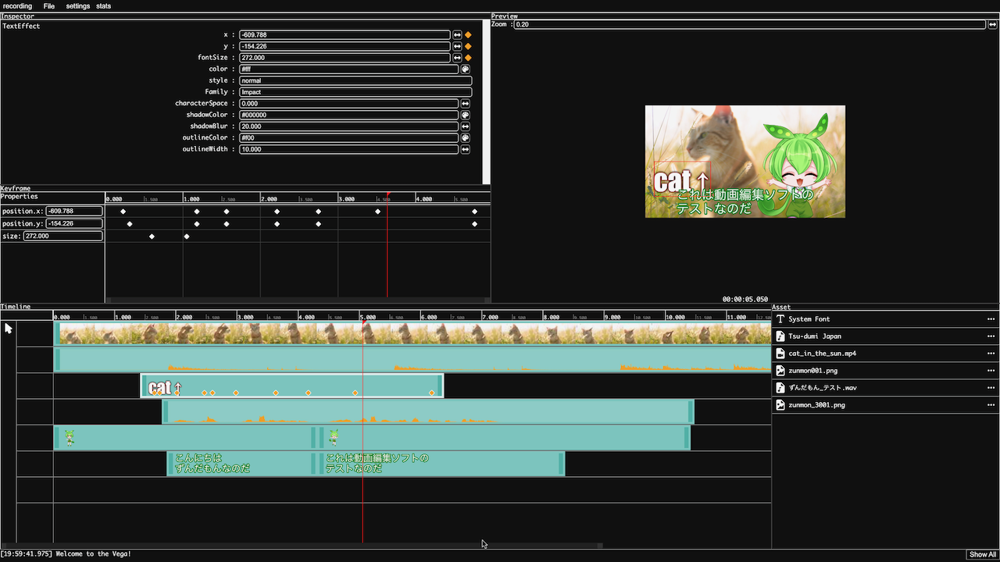

# Vega

Vega is an open source video editing software.

__This project is still under development and has many bugs. If you like it, please star and support this project.__

:point_right: __[Home page](https://toshusai.github.io/Vega)__  

## Download
:point_right: https://github.com/toshusai/Vega/releases

## How to use
:construction:

## Support Platforms
- :white_check_mark: Mac (arm64, x64)
- :white_check_mark: Windows
- :construction: Linux

## License
MIT License

## Motivation
I see potential in web technology and believe that even video editing software can be created. I aim for this software to replace software such as AviUtl (a free video editing software made in Japan) and After Effects.