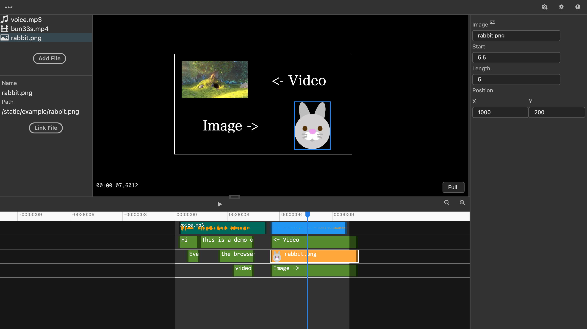

# Vega

Vega is a open source web based video editor. 

:warning: This is an experimental project.

__[Editor](https://vega.toshusai.net)__ /
__[DEMO](https://vega.toshusai.net/editor?demo=true)__ /
__[Documents](https://vega.toshusai.net/docs)__

## Support Browsers
- Google Chrome 92 or later
- Electron (Windows / OSX)

## Features
- Assets
  - Video :white_check_mark:
    - mp4 :white_check_mark:
    - quicktime :white_check_mark:
    - webm :white_check_mark:
  - Audio
    - wav :white_check_mark:
    - mp3 :white_check_mark:
    - mpeg :white_check_mark:
    - oog :white_check_mark:
  - Image
    - png :white_check_mark:
    - jpg / jpeg :white_check_mark:
  - Text
    - custom fonts :construction:
- Strips
  - Text
    - position :white_check_mark:
    - length :white_check_mark:
    - font
      - size :white_check_mark:
      - family :eight_spoked_asterisk:
      - style :white_check_mark:
      - color :white_check_mark:
    - outline :white_check_mark:
    - shadow :white_check_mark:
  - Video
    - position :white_check_mark:
    - length :white_check_mark:
    - split :white_check_mark:
    - scale :construction:
    - volume :construction:
    - speed :construction:
    - opacity :construction:
  - Audio
    - position :white_check_mark:
    - length :white_check_mark:
    - split :construction:
    - volume :construction:
    - speed :construction:
  - Image
    - position :white_check_mark:
    - length :white_check_mark:
    - split :construction:
    - scale :construction:
    - opacity :construction:
- Settings
  - resolutions :white_check_mark:
  - fps :white_check_mark:
  - duration :white_check_mark:
- Export
  - mp4 :white_check_mark:
    - configs :construction:
  - gif :construction:
- Others
  - layers :white_check_mark:
  - save / load project :white_check_mark:
  - Animations :construction:
  - Native FFmpeg integration :construction:
  - Undo / Redo :construction:

## Development
Check [static/docs/dev/README.md](src/renderer/static/docs/dev/README.md)

blog (en): https://dev.to/toshusai/how-to-create-a-video-editor-that-works-in-your-browser-5akh  
blog (ja): https://zenn.dev/toshusai/articles/fb883a7c3a1f05

## License
MIT License

[Thanks Open Source](./src/renderer/static/docs/Thanks.md)