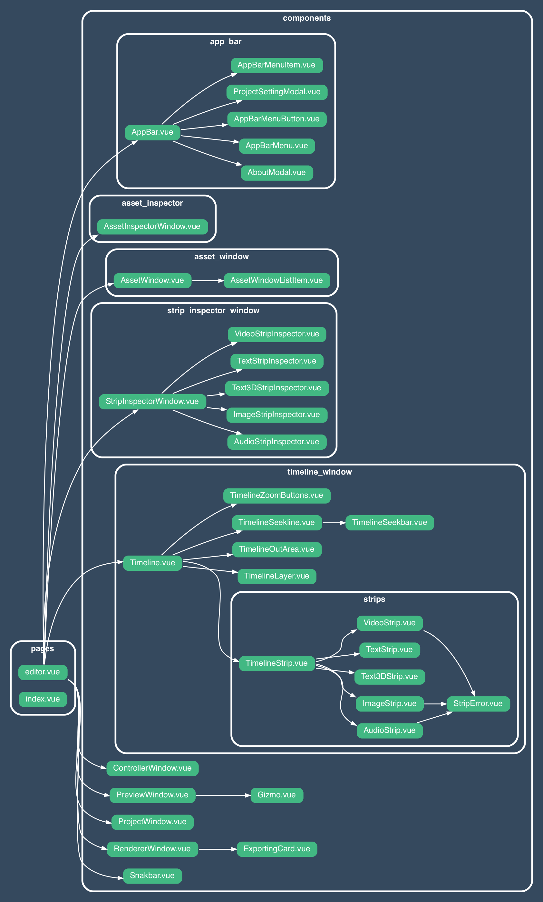

# Vue Component Dependency graph.

https://github.com/sverweij/dependency-cruiser

```
cd src/renderer
depcruise --config .dependency-cruiser.js --output-type dot . | dot -T png -Gdpi=200  > static/docs/dev/dependencygraph.png
```



commit 0298ebd551c4d4a4af55da1418d8976ab94cf0fb