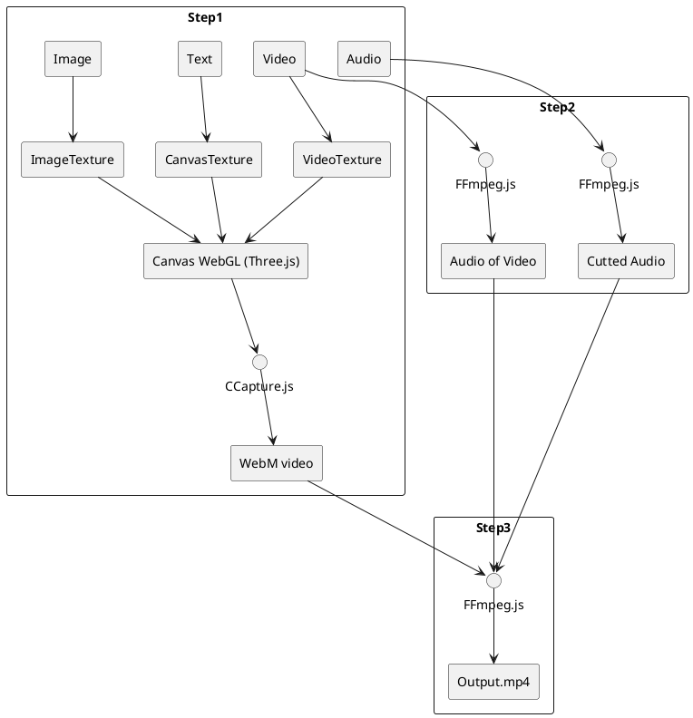

# basic ideas

1. Convert all frames to webm by ccapture.js
2. Get splited audio in Video/Audio by ffmpeg.
3. Merge webm and audio by ffmpeg.

```plantuml
@startuml
'left to right direction

rectangle Step1{
    rectangle Text
    rectangle Video
    rectangle Audio
    rectangle Image

    rectangle "Canvas WebGL (Three.js)" as Canvas_WebGL
    circle "CCapture.js" as CCapture

    rectangle "CanvasTexture" as TextCanvas
    Text --> TextCanvas 
    TextCanvas --> Canvas_WebGL 

    rectangle VideoTexture 
    Video --> VideoTexture 
    VideoTexture --> Canvas_WebGL 

    rectangle ImageTexture 
    Image --> ImageTexture
    ImageTexture --> Canvas_WebGL 

    rectangle "WebM video" as WebM
    Canvas_WebGL --> CCapture
    CCapture --> WebM
}

rectangle Step3{
    circle "FFmpeg.js" as FFmpeg
    WebM --> FFmpeg

    rectangle "Output.mp4" as Output
    FFmpeg --> Output
}

rectangle Step2{
    circle "FFmpeg.js" as FFmpeg2
    circle "FFmpeg.js" as FFmpeg3
    rectangle "Audio of Video" as VideoAudio
    Video --> FFmpeg2
    FFmpeg2 --> VideoAudio
    VideoAudio--> FFmpeg

    rectangle "Cutted Audio" as CuttedAudio 
    Audio --> FFmpeg3
    FFmpeg3 -->CuttedAudio 

    CuttedAudio --> FFmpeg
}


@enduml
```